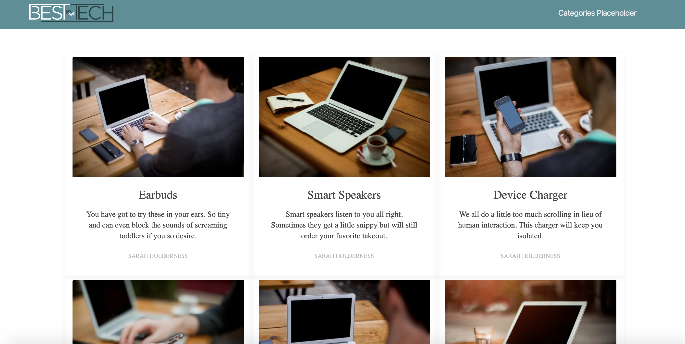

# Blog-with-Spring-Boot
Build a Basic Blog with Spring Boot

# Setup
Set up your local environment for projects. We'll walk you through everything you need to know, including how to install and configure your environment to be able to complete all of the tasks.

# Create a controller that displays a Thymeleaf Template
In this module, you'll create a controller that routes a request to the home template and passes data to it to display.

# Display Static Data from the Post Repository
In this module, we'll add blog data to the PostRepository class and then display that data in our template.

# Add style to the home page
In this module, we'll incorporate css and template substitution into our home template.

# Display a Post Details Page
In this module, we'll display a post details page by adding a request mapping to the controller.
